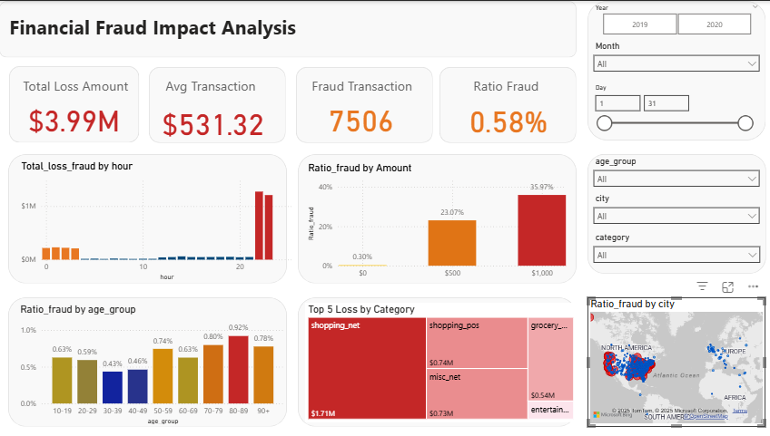

# 💸 Financial Fraud Impact Analysis: Incident Metrics & Financial Impact Dashboard

## Project Overview

This project focuses on Business Intelligence (BI) and Data Governance to quantify and visualize the financial impact of transactional fraud. The primary goal is to identify **financial loss hotspots** and the **most vulnerable age groups** targeted by fraudulent activities.

**Tools & Technologies:**
* **Visualization & BI:** Power BI Desktop (`Fraud.pbix`)
* **Data Validation & Scripting:** Python (Pandas, NumPy) (`fraud.ipynb`)
* **Version Control:** Git & GitHub

---

## 🎯 Key Findings

This analysis is based on transactional data, revealing a total verified financial loss of **$3,988,088.61** (equivalent to **$3.99 Million**) after critical data correction.

1.  **Age Vulnerability:** The **80+ years** age group exhibits the highest Fraud Ratio (above 1.0%), making them the most vulnerable target demographic.
2.  **Loss Hotspots:** The **`shopping_net`** and **`shopping_pos`** merchant categories are the largest contributors to the total financial loss.
3.  **Incident Rate:** The overall Fraud Ratio is confirmed at **0.58%**, aligning with industry standards for rare anomalies.
4.  **Time-based Risk Distribution:** Fraud incidents peak between **10:00 PM and 02:00 AM**, suggesting system vulnerabilities during reduced operational hours or specific windows targeted by fraudsters.

---

## 🛠️ Data Governance & Data Correction Methodology

The most significant challenge in this project was a data governance issue where Power BI initially misinterpreted the `amt` (transaction amount) column, resulting in an incorrect initial loss value of **$361.36 Million**.

**The Problem:** Power BI incorrectly read the decimal/thousand format, treating the `amt` column as an `Int64`.

**The Solution (Power Query):**
1.  **Text Cleaning:** Eliminated thousand separators (commas `,`) using the `Replace Values` step.
2.  **Locale Conversion:** Changed the final data type to *Decimal Number* using the **Locale: English (United States)** to force Power BI to correctly recognize the decimal point.
3.  **Validation:** The final result of **$3,988,088.61** in Power BI was validated and confirmed by the Python script.

---

## 📈 Core Dashboard Metrics

The main dashboard focuses on Incident Metrics and Financial Impact:

| Metric | Purpose | DAX/Calculation |
| :--- | :--- | :--- |
| **Total Loss Amount** | Actual Monetary Loss | `SUM(Fraud[Total loss fraud])` |
| **Ratio Fraud** | Transaction Risk Rate | `DIVIDE(COUNTROWS('Fraud'[is_fraud]=1), COUNTROWS('Fraud'))` |
| **Ratio Fraud by Age Group** | Victim Vulnerability | (Used for Bar Chart) |
| **Top 5 Loss by Category** | Loss Allocation | `Total Loss` by `category` |

---

## 🚀 How to Explore the Project

* **Power BI Dashboard:** Download the `Fraud.pbix` file to interactively explore the dashboard, using slicers to filter by Time, Location, and Merchant Category.
* **Python Validation:** Review the `fraud.ipynb` notebook to examine the data cleaning script and the validation of the true total loss value.

---
## 📸 Dashboard Snapshot

 
